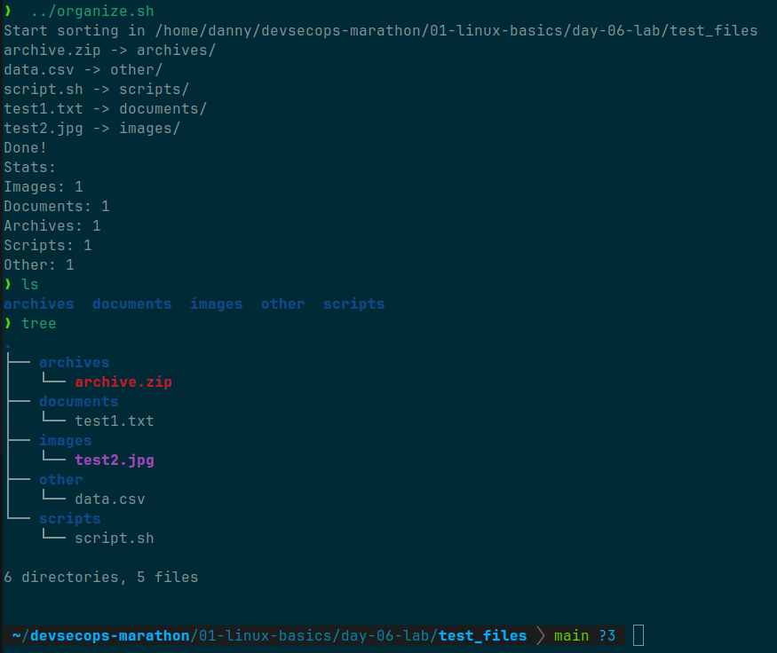

# Stage 01: Linux & Git Basics
## Day 06: File auto sorting script

1. **Summary:**

- Wrote a bash-script that automatically sorts files into folders based on their extensions
- Script creates directories: `/images`, `/documents`, `/archives`, `/scripts`, `/other` 

2. **Key concepts:**

- `for file in *` - iterate through all files
- `if [[ -d $file ]]` - check if it's a directory
- `extension="${file##*.}` - extract file extension
- `case "$extension" in ... esac` - choose action based on extension
- `((count++))` - counters 

### Result

Wrote a script to auto-sorting files. Learned `for`, `case`, `${file##*.}`.

